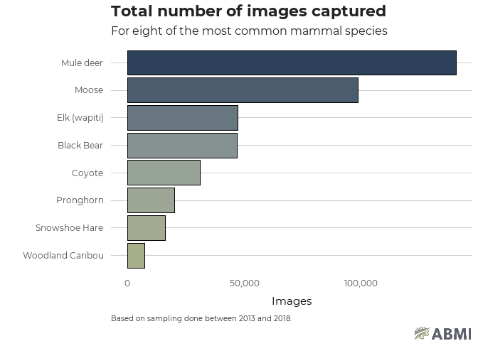
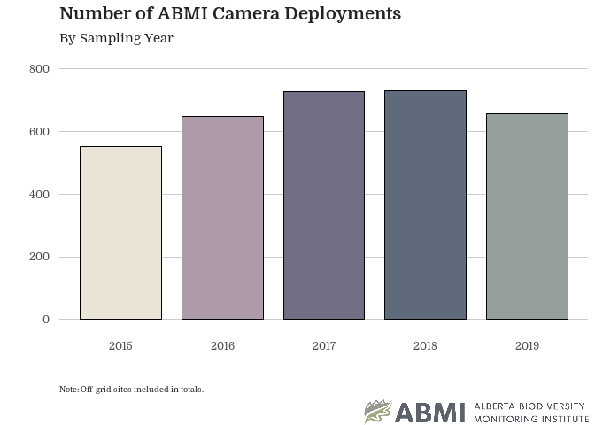

abmi.themes
===========

> Functions to make ABMI-themed ggplot2 graphics

Installation
------------

``` r
# install.packages("remotes")
remotes::install_github("mabecker89/abmi.themes")
```

Aesthetics
----------

### Palettes

There are five available palettes:

-   "main" (This is the default, and is built using the ABMI's three main colour values.)
-   "flowers"
-   "mountains"
-   "lichen"
-   "birds"

These can be explored using the `abmi_pal()` and `print_palette()` functions within the console.

``` r
library(abmi.themes)

# Define palette and the number of categories to interpolate to.
pal <- abmi_pal("main")(3)
print_palette(pal)
```


The "flowers" palette:

``` r
print_palette(abmi_pal("flowers")(5))
```


The "mountains" palette:

``` r
print_palette(abmi_pal("mountains")(5))
```


The "lichen" palette:

``` r
print_palette(abmi_pal("lichen")(5))
```


The "birds" palette:

``` r
print_palette(abmi_pal("birds")(6))
```


### Fonts

The ABMI has two official web fonts:

-   [Montserrat](https://fonts.google.com/specimen/Montserrat)
-   [Domine](https://fonts.google.com/specimen/Domine)

Usage
-----

There are four functions from this package that can be used to produce graphics with an ABMI theme: `scale_fill_abmi()`, `scale_colour_abmi()`, `theme_abmi()`, and `add_logo()`.

The first two are fill and colour constructors that can be used to add the above palettes to a ggplot's aesthetics. Like other `scale_fill_*` or `scale_colour_*` functions from ggplot2, they can be added to a ggplot2 chain and take the palette name as an argument. The user can also reverse the palette with the `reverse` argument.

The third function, `theme_abmi()` is used to access one of the two official ABMI web fonts ("Montserrat", the default, or "Domine", the alternative). Like other ggplot2 themes, `theme_abmi()` provides a sensible default option (with respect to font sizes, margins, etc). However, the user can override these defaults by simply chaining (`+`) another `theme()` call afterwards and re-specifying certain elements.

Finally, `add_logo()` takes a plot object and adds an ABMI logo to (by default) the bottom right of the plot. More options (i.e. logos) will be added to the package in time, although the user can specify an alternative path to a logo of their choosing using the `logo_image_path` argument.

### Example Plots

``` r
library(ggplot2)
library(showtext)

# Create plot
p <- ggplot(mammals, aes(x = common_name, y = images, fill = common_name)) +
  geom_col(color = "black") +
  coord_flip() +
  scale_y_continuous(labels = scales::comma) +
  labs(title = "Total number of images captured",
       subtitle = "For eight of the most common mammal species",
       caption = "Based on sampling done between 2013 and 2018.",
       y = "Images",
       x = "")

# Change to ABMI theme, remove legend, and use the "main" palette
p1 <- p + 
  theme_abmi() +
  theme(legend.position = "none") +
  scale_fill_abmi(palette = "main", reverse = TRUE)

# Finally add ABMI logo
add_logo(p1)
```



``` r
# Create plot
p2 <- ggplot(dep, aes(x = year, y = n, fill = year)) +
  geom_col(color = "black", width = 0.8) +
  labs(x = "",
       y = "",
       title = "Number of ABMI Camera Deployments",
       subtitle = "By Sampling Year",
       caption = "Note: Off-grid sites included in totals.") +
  scale_y_continuous(breaks = seq(0, 800, 200), limits = c(0, 800))

p3 <- p2 +
  theme_abmi(font = "Domine") +
  scale_fill_abmi(palette = "flowers", reverse = TRUE) +
  theme(title = element_text(size = 10),
        legend.position = "none")

add_logo(p3)
```


